# Z360 Multi-Org AI Agent via LangGraph: LTM/STM Memory Architecture with Vector Storage

## Overview

Z360's AI agent represents a sophisticated multi-org conversational AI system built on LangGraph, designed to serve multiple organizations while maintaining strict data isolation and privacy boundaries. The system implements a comprehensive memory architecture combining Short-Term Memory (STM) via PostgreSQL checkpointing and Long-Term Memory (LTM) through vector storage, enabling continuous learning and personalization across organizational contexts. Each organization operates with its own knowledge base, user data, abilities, and memory stores in Qdrant vector collections, while sharing common infrastructure components for optimal resource utilization and operational efficiency.

## System Architecture

```mermaid
graph TB
    %% ===========================================
    %% CLIENT LAYER
    %% ===========================================
    subgraph CLIENT["<b>🌐 Client Layer</b>"]
        Phone[📱 Phone System]
        Web[💻 Web Interface] 
        API[🔌 API Clients]
    end
    
    %% ===========================================
    %% AGENT LAYER
    %% ===========================================
    subgraph AGENT["<b>🤖 Agent Layer</b>"]
        Router[🔀 Request Router & Auth]
        LG[🧠 LangGraph Agent]
        LLM[✨ LLM Provider<br/>Gemini]
    end
    
    %% ===========================================
    %% MEMORY PROCESSING
    %% ===========================================
    subgraph MEMORY["<b>💾 Memory Processing</b>"]
        CP[📍 Checkpointer<br/>PostgreSQL]
        MS[🗄️ Memory Store<br/>Metadata]
        MC[🏷️ Memory Classifier]
        MR[🔍 Memory Retriever]
    end
    
    %% ===========================================
    %% EMBEDDING LAYER
    %% ===========================================
    subgraph EMBEDDING["<b>🔤 Embedding Layer</b>"]
        EM[🎯 Gemini Embedding Model]
    end
    
    %% ===========================================
    %% VECTOR STORAGE
    %% ===========================================
    subgraph VECTOR["<b>📊 Vector Storage - Qdrant DB</b>"]
        subgraph ORG1["Organization 1"]
            O1K[Knowledge]
            O1E[Episodic]
            O1S[Semantic]
            O1P[Procedural]
        end
        
        subgraph ORG2["Organization 2"]
            O2K[Knowledge]
            O2E[Episodic]
            O2S[Semantic]
            O2P[Procedural]
        end
        
        subgraph ORGN["Organization N"]
            ONK[Knowledge]
            ONE[Episodic]
            ONS[Semantic]
            ONP[Procedural]
        end
    end
    
    %% ===========================================
    %% DATA LAYER (Positioned to the right)
    %% ===========================================
    subgraph DATA["<b>🗃️ Data Layer</b>"]
        subgraph DB["PostgreSQL Database"]
            OrgDB[Organizations Table]
            UsersDB[Users Table]
            AbilityDB[Abilities Table]
        end
        Cache[⚡ Redis Cache]
        Docs[📄 Document Storage]
    end
    
    %% ===========================================
    %% TOOLS LAYER (Positioned to the left)
    %% ===========================================
    subgraph TOOLS["<b>🔧 Tools Layer</b>"]
        MockAPI[FastAPI Mock]
        SMTP[Email API]
        Cal[Calendar API]
        ThirdParty[External APIs]
    end
    
    %% ===========================================
    %% OBSERVABILITY (Positioned at the bottom)
    %% ===========================================
    subgraph OBSERVABILITY["<b>📈 Observability</b>"]
        Trace[🔍 LangFuse Tracing]
        Evals[📊 Evaluation Pipeline]
    end
    
    %% ===========================================
    %% CONNECTIONS
    %% ===========================================
    
    %% Client to Agent
    Phone --> Router
    Web --> Router
    API --> Router
    
    %% Agent processing flow
    Router --> LG
    LG <--> LLM
    
    %% Agent to Memory
    LG <--> CP
    LG --> MC
    MR --> LG
    
    %% Memory processing flow
    MC --> MS
    MC --> EM
    MR --> EM
    %% Embedding to Vector Storage (simplified for clarity)
    EM --> ORG1
    EM --> ORG2
    EM --> ORGN
    
    %% Agent to Data Layer
    LG <--> DB
    LG <--> Cache
    LG <--> Docs
    
    %% Agent to Tools Layer
    LG <--> MockAPI
    LG <--> SMTP
    LG <--> Cal
    LG <--> ThirdParty
    
    %% Agent to Observability
    LG -.-> Trace
    LG -.-> Evals
    
    %% Memory connections to Data
    CP <--> DB
    MS <--> Cache
    
    %% ===========================================
    %% STYLING FOR CLARITY
    %% ===========================================
    
    classDef clientStyle fill:#4ECDC4,stroke:#1A535C,stroke-width:3px,color:#fff
    classDef agentStyle fill:#F7B267,stroke:#F25C54,stroke-width:3px,color:#fff
    classDef memoryStyle fill:#C7F464,stroke:#5D737E,stroke-width:3px,color:#333
    classDef embeddingStyle fill:#FF6B6B,stroke:#C44569,stroke-width:3px,color:#fff
    classDef vectorStyle fill:#845EC2,stroke:#4E4376,stroke-width:3px,color:#fff
    classDef dataStyle fill:#4E8098,stroke:#2C5F7C,stroke-width:3px,color:#fff
    classDef toolStyle fill:#F9A26C,stroke:#F26627,stroke-width:3px,color:#fff
    classDef obsStyle fill:#325D79,stroke:#1C3144,stroke-width:3px,color:#fff
    classDef orgStyle fill:#9C89B8,stroke:#6C5B7B,stroke-width:2px,color:#fff
    classDef dbStyle fill:#5C85A6,stroke:#3A5A7A,stroke-width:2px,color:#fff
    
    %% Apply styles
    class Phone,Web,API clientStyle
    class Router,LG,LLM agentStyle
    class CP,MS,MC,MR memoryStyle
    class EM embeddingStyle
    class ORG1,ORG2,ORGN orgStyle
    class O1K,O1E,O1S,O1P,O2K,O2E,O2S,O2P,ONK,ONE,ONS,ONP vectorStyle
    class DB dbStyle
    class OrgDB,UsersDB,AbilityDB,Cache,Docs dataStyle
    class MockAPI,SMTP,Cal,ThirdParty toolStyle
    class Trace,Evals obsStyle
    
    %% ===========================================
    %% LAYOUT HINTS
    %% ===========================================
    
    %% Position Data Layer to the right
    LG -.-> DATA
    
    %% Position Tools Layer to the left  
    TOOLS -.-> LG
    
    %% Position Observability at the bottom
    LG -.-> OBSERVABILITY
```

## Core Components

### Client Layer
**Multi-channel input interface** supporting phone systems, web interfaces, and API clients. Handles initial user interactions and routes requests to the agent layer while maintaining session context and authentication tokens.

### Agent Layer
**LangGraph Runtime Environment** orchestrating the core conversational AI logic. The Request Router identifies organization and user context from incoming requests, while the LangGraph Agent executes conversation flows enhanced with memory-aware processing. Gemini LLM provider generates intelligent responses based on retrieved context and organizational knowledge.

### Memory Processing Layer
**Intelligent memory management system** implementing four key components:
- **Checkpointer (STM)**: Maintains conversation state in PostgreSQL for thread resumption and short-term memory
- **Memory Store**: Tracks memory metadata, relationships, and lifecycle information
- **Memory Classifier**: Analyzes conversations to determine what information should be remembered long-term
- **Memory Retriever**: Performs semantic search across organizational memory collections for LTM access

### Embedding Layer
**Semantic processing pipeline** using Gemini's text-embedding model to convert textual information into numerical vectors, enabling intelligent similarity search across knowledge bases and memory stores.

### Vector Storage Layer (LTM)
**Qdrant database implementation** providing isolated vector collections per organization for Long-Term Memory:
- **Knowledge Collections**: Organizational documents, FAQs, policies
- **Episodic Collections**: Conversation summaries and interaction histories
- **Semantic Collections**: User facts, preferences, and business knowledge
- **Procedural Collections**: Successful workflow patterns and process knowledge

### Data Layer
**Structured data storage** managing organizational hierarchy and relationships:
- **PostgreSQL Database**: Core entity storage with multi-org isolation
- **Redis Cache**: High-performance caching for sessions and frequently accessed data
- **Document Storage**: File management for attachments and organizational documents

### Tools Layer
**External service integration** providing agent capabilities through FastAPI services, email APIs, calendar systems, and third-party integrations. Tools are scoped to organizational permissions and capabilities.

### Observability Layer
**System monitoring and evaluation** using LangFuse for request tracing and custom evaluation pipelines for response quality measurement.

## Memory Architecture: STM + LTM Integration

### Short-Term Memory (STM)
**PostgreSQL Checkpointer** manages conversation state and immediate context:
- Current conversation messages and thread state
- Active workflow progress and temporary variables
- Session-specific user context and preferences
- Conversation flow state for thread resumption

### Long-Term Memory (LTM) 
**Qdrant Vector Storage** enables persistent, searchable memory across sessions:
- **Episodic Memory**: Historical conversation summaries and interaction patterns
- **Semantic Memory**: Persistent facts about users, preferences, and organizational knowledge
- **Procedural Memory**: Learned workflow patterns and successful process sequences
- **Knowledge Memory**: Organizational documents and reference materials

### Memory Transition Pipeline
**STM → LTM Conversion Process**:
1. Conversation analysis at session end
2. Important information extraction via Memory Classifier
3. Semantic embedding generation for searchable storage
4. Categorization into appropriate LTM collections
5. Metadata storage for retrieval optimization

## Data Flow Architecture

### User Interaction Sequence

1. **Request Ingestion**: Client layer receives user interaction with identifying information (phone number, session token)
2. **Context Resolution**: Router maps user to organization and loads organizational context
3. **STM Activation**: Checkpointer loads current conversation state and recent context
4. **LTM Retrieval**: Memory retriever performs semantic search across organization-specific Qdrant collections
5. **Agent Processing**: LangGraph agent processes request with full STM + LTM context and organizational abilities
6. **Tool Execution**: Agent invokes organization-specific tools and external services as needed
7. **Response Generation**: LLM generates contextually-aware response using retrieved memories
8. **Memory Formation**: Memory classifier analyzes interaction and stores relevant information in appropriate LTM collections
9. **STM Persistence**: Checkpointer saves updated conversation state for future thread resumption

### Memory Classification Pipeline

**Episodic Memory Formation**: Conversation summaries, interaction outcomes, and temporal event sequences stored in Qdrant
**Semantic Memory Extraction**: User preferences, factual information, and relationship mappings persisted as searchable vectors
**Procedural Memory Learning**: Successful workflow patterns, decision trees, and process optimizations captured for reuse

## Multi-Org Architecture

### Organizational Isolation
Each organization operates within isolated namespaces across all system layers. Qdrant vector collections, database records, and cache entries are scoped by organization ID, ensuring complete data separation and privacy compliance.

### User Management
Users are scoped to organizations through hierarchical relationships. Phone numbers serve as primary identifiers, mapping to user records within organizational contexts. User-specific memories maintain privacy boundaries while enabling personalized service delivery.

### Ability Engine Integration
Organizational abilities are stored as JSON configurations in the database, loaded dynamically based on organizational context. Abilities define available tools, conversation flows, and business logic specific to each organization's operational requirements.

### Memory Segregation Strategy
- **User-Specific Memories**: Tagged with `org_id + user_id` for complete isolation in Qdrant collections
- **Organization-Wide Memories**: Shared across organizational users but isolated from other organizations  
- **Cross-Organizational Learning**: Anonymized procedural patterns shared for system-wide improvement

## Technology Stack

### Core Infrastructure
- **LangGraph**: Conversational AI orchestration framework
- **PostgreSQL**: Primary database for structured data and STM checkpointing
- **Qdrant**: Vector database for LTM semantic search and memory storage
- **Redis**: High-performance caching layer
- **FastAPI**: Service layer for tool integration

### AI/ML Components  
- **Gemini LLM**: Large language model for response generation
- **Gemini Embeddings**: Text-to-vector conversion for semantic search
- **LangChain**: LLM integration and tool management framework

### Observability & Operations
- **LangFuse**: Request tracing and performance monitoring
- **Custom Evaluation Pipeline**: Response quality assessment
- **Docker**: Containerized deployment architecture

## Implementation Prerequisites

### Technical Concepts
- **Vector Databases**: Understanding of embedding storage, similarity search, and collection management in Qdrant
- **LangGraph Framework**: State management, node orchestration, and tool integration patterns
- **Memory Systems**: STM/LTM integration, episodic/semantic/procedural memory models in AI systems
- **Multi-Org Architecture**: Data isolation, namespace management, and security boundaries

### Infrastructure Requirements
- **Container Orchestration**: Docker/Kubernetes for scalable deployment
- **Database Administration**: PostgreSQL optimization for high-concurrency workloads  
- **Vector Database Management**: Qdrant cluster configuration and maintenance
- **Cache Strategy**: Redis cluster management and cache invalidation patterns

### Development Expertise
- **Prompt Engineering**: System prompt design and memory-aware prompt construction
- **Conversation Design**: Multi-turn dialogue management and context preservation
- **API Integration**: RESTful service design and external system integration
- **Evaluation Framework**: LLM response quality measurement and system performance metrics

## References

- [LangGraph Memory Architecture](https://medium.com/@anil.jain.baba/long-term-agentic-memory-with-langgraph-824050b09852)
- [LangGraph Official Documentation](https://langchain-ai.github.io/langgraph/concepts/memory/)  
- [Semantic Memory Implementation Guide](https://medium.com/@Micheal-Lanham/building-ai-agents-with-long-term-memory-a-guide-to-semantic-memory-implementation-44eb48028c5e)
- [Multi-Org AI Systems](https://saptak.in/writing/2025/03/23/mastering-long-term-agentic-memory-with-langgraph)
- [Qdrant Vector Database Documentation](https://qdrant.tech/documentation/)
- [LangChain MCP Integration](https://langchain-ai.github.io/langgraph/reference/mcp/)

---

*This document serves as the foundational architecture reference for implementing memory-enabled, multi-org conversational AI agents using LangGraph with integrated STM/LTM architecture and vector storage technologies.*
