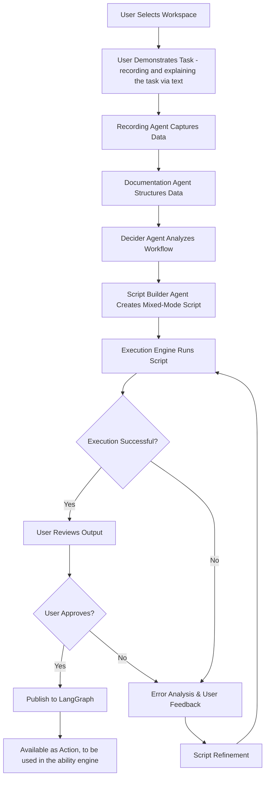

# Intelligent Browser Automation System - Implementation Brief

## Executive Summary

This document outlines the implementation of Z360's Intelligent Browser Automation System using Stagehand and Browserbase. The system enables users to create complex browser automation workflows through demonstration, with AI agents intelligently segmenting tasks across three execution tiers for optimal reliability and performance.

## Current State & Limitations

### What We Have Now
- Basic Stagehand + Browserbase integration for simple workflows
- Single-mode execution (primarily RPA-style automation)
- Manual script creation requiring technical expertise
- Limited error handling and recovery mechanisms

### Current Limitations
1. **Reliability Issues**: Complex workflows fail due to rigid scripting approaches
2. **No Intelligence**: Cannot adapt to dynamic content or unexpected page states
3. **Manual Overhead**: Requires developers to write and maintain scripts
4. **Poor Error Recovery**: Failures result in complete workflow breakdown
5. **Limited Scalability**: Each new workflow requires custom development

## The New Approach: Mixed-Mode Intelligent Automation

### Core Philosophy
Instead of forcing workflows into rigid tiers, we create **dynamic mixed-mode workflows** that intelligently switch between execution modes within a single browser session, leveraging Stagehand's native capabilities.

### Three-Tier Execution Model
1. **Tier 1 (Deterministic RPA)**: Playwright-based actions for predictable, stable interactions
2. **Tier 2 (Agentic RPA)**: Stagehand tools (`act()`, `extract()`, `observe()`) for semi-dynamic tasks
3. **Tier 3 (Autonomous)**: Computer Use models for complex visual reasoning and dynamic scenarios

## System Architecture Overview



## Detailed Process Flow

### Phase 1: Workspace Selection & Demonstration
**User Experience:**
1. User selects a workspace with persistent browser sessions
2. User navigates to starting URL and begins task demonstration
3. System captures every interaction, DOM state, and page changes
4. User provides natural language description of the task and goals

**Technical Implementation:**
- Browserbase provides persistent browser sessions with authentication
- Recording agent captures DOM snapshots, user actions, and page metadata
- Session state preservation across demonstration and execution

### Phase 2: Data Processing & Documentation

**Browserbase Session Logging Capabilities:**
Based on Browserbase's session logs API, the system captures comprehensive execution data:

```typescript
interface BrowserbaseSessionLog {
  method: string           // HTTP method or browser action
  pageId: number          // Unique page identifier
  sessionId: string       // Browser session ID
  request: {
    timestamp: number     // Request initiation time
    params: object       // Request parameters
    rawBody: string      // Raw request data
  }
  response: {
    timestamp: number     // Response completion time
    result: object       // Structured response data
    rawBody: string      // Raw response content
  }
  timestamp: number       // Overall action timestamp
  frameId: string        // Browser frame identifier
  loaderId: string       // Page loader identifier
}
```

**Enhanced Documentation Agent Structure:**
```typescript
interface WorkflowDocumentation {
  // Core Identification
  sessionId: string
  workflowId: string
  recordingTimestamp: number
  
  // User Intent & Context
  taskDescription: string
  userGoal: string
  expectedOutcome: string
  businessContext: string
  
  // Technical Recording Data
  recordedActions: EnhancedRecordedAction[]
  domSnapshots: DetailedDOMSnapshot[]
  pageTransitions: PageTransition[]
  networkActivity: NetworkLog[]
  browserLogs: BrowserbaseSessionLog[]
  
  // Analysis & Metadata
  userContext: UserContext
  environmentContext: EnvironmentContext
  metadata: WorkflowMetadata
}

interface EnhancedRecordedAction {
  // Basic Action Data
  timestamp: number
  sequenceNumber: number
  type: 'click' | 'input' | 'navigation' | 'wait' | 'scroll' | 'hover' | 'keypress'
  
  // Target Element Information
  target: {
    xpath: string
    cssSelector: string
    textContent: string
    elementType: string
    attributes: Record<string, string>
    boundingBox: DOMRect
    isVisible: boolean
    isInteractable: boolean
  }
  
  // Action Context
  value?: string
  coordinates?: { x: number, y: number }
  keyCode?: string
  modifierKeys?: string[]
  
  // Page State Context
  pageState: {
    url: string
    title: string
    loadState: 'loading' | 'domcontentloaded' | 'networkidle'
    viewport: { width: number, height: number }
    scrollPosition: { x: number, y: number }
  }
  
  // DOM Context
  domContext: {
    parentElements: ElementInfo[]
    siblingElements: ElementInfo[]
    nearbyInteractables: ElementInfo[]
    pageStructure: PageStructureInfo
  }
  
  // Execution Metadata
  executionTime: number
  success: boolean
  errorMessage?: string
  retryCount: number
}

interface DetailedDOMSnapshot {
  timestamp: number
  url: string
  html: string
  
  // Structural Analysis
  interactableElements: InteractableElement[]
  formElements: FormElement[]
  navigationElements: NavigationElement[]
  contentElements: ContentElement[]
  
  // Stability Metrics
  domStability: number      // 0-1, how stable the DOM structure is
  layoutStability: number   // 0-1, how stable the visual layout is
  contentStability: number  // 0-1, how stable the text content is
  
  // Performance Metrics
  loadTime: number
  renderTime: number
  interactivityTime: number
}
```

**Comprehensive Workflow Documentation Format:**

The Documentation Agent creates a structured narrative that includes:

1. **Executive Summary**
   - What the user wanted to accomplish
   - High-level workflow overview
   - Expected business outcome

2. **Session Context**
   - Browser environment details
   - Authentication state
   - Starting conditions

3. **Step-by-Step Action Log**
   ```markdown
   ## Step 1: Navigate to Login Page
   **User Action**: Clicked "Login" button in navigation
   **Technical Details**:
   - Target Element: `<button class="login-btn" id="nav-login">Login</button>`
   - XPath: `//*[@id="nav-login"]`
   - Page URL: https://example.com/
   - Timestamp: 2024-01-15T10:30:15.123Z
   - DOM Stability: 0.95 (highly stable)
   
   **Page Transition**: 
   - From: https://example.com/
   - To: https://example.com/login
   - Load Time: 1.2s
   - New Elements Detected: 15 (login form, validation messages)
   ```

4. **Technical Execution Data**
   - Network requests and responses
   - JavaScript execution logs
   - Performance metrics
   - Error conditions and recoveries

5. **Context Analysis**
   - Element stability patterns
   - Dynamic content identification
   - Interaction complexity assessment
   - Potential failure points

### Phase 3: Intelligent Workflow Analysis

**Enhanced Decider Agent Analysis:**
Based on research into browser automation patterns and Stagehand's capabilities, the Decider Agent evaluates multiple dimensions:

```typescript
interface SegmentAnalysis {
  segmentId: string
  actions: EnhancedRecordedAction[]
  complexity: AdvancedComplexityMetrics
  recommendedTier: ExecutionTier
  confidence: number
  reasoning: string
  fallbackTier?: ExecutionTier
  riskAssessment: RiskAssessment
}

interface AdvancedComplexityMetrics {
  // DOM & Layout Stability
  domStability: number              // 0-1, structural consistency
  layoutStability: number           // 0-1, visual layout consistency
  selectorReliability: number       // 0-1, CSS/XPath selector stability
  
  // Content Dynamics
  dynamicContentPresence: number    // 0-1, presence of changing content
  ajaxActivityLevel: number         // 0-1, level of async operations
  contentLoadingPatterns: number    // 0-1, predictability of content loading
  
  // Interaction Complexity
  actionPredictability: number      // 0-1, how predictable actions are
  userInputComplexity: number       // 0-1, complexity of required inputs
  multiStepDependency: number       // 0-1, interdependence of actions
  conditionalLogicRequired: number  // 0-1, need for decision making
  
  // Visual & Contextual Requirements
  visualReasoningRequired: number   // 0-1, need for visual interpretation
  contextualUnderstanding: number   // 0-1, need for semantic understanding
  spatialReasoningRequired: number  // 0-1, need for spatial relationships
  
  // Error Handling & Recovery
  errorHandlingComplexity: number   // 0-1, complexity of error scenarios
  recoveryMechanisms: number        // 0-1, availability of recovery paths
  timeoutSensitivity: number        // 0-1, sensitivity to timing issues
  
  // Authentication & Security
  authenticationRequired: number    // 0-1, need for auth handling
  securityConstraints: number       // 0-1, presence of security measures
  sessionManagement: number         // 0-1, complexity of session handling
  
  // Performance & Scalability
  resourceIntensity: number         // 0-1, computational requirements
  networkDependency: number         // 0-1, reliance on network conditions
  concurrencyComplexity: number     // 0-1, issues with parallel execution
}

interface RiskAssessment {
  failureRisk: 'low' | 'medium' | 'high'
  maintenanceRisk: 'low' | 'medium' | 'high'
  performanceRisk: 'low' | 'medium' | 'high'
  riskFactors: string[]
  mitigationStrategies: string[]
}
```

**Enhanced Decision Logic:**

**Tier 1 (Playwright - Deterministic RPA):**
```typescript
const isTier1Suitable = (metrics: AdvancedComplexityMetrics) => {
  return (
    metrics.domStability > 0.85 &&
    metrics.selectorReliability > 0.9 &&
    metrics.actionPredictability > 0.8 &&
    metrics.dynamicContentPresence < 0.3 &&
    metrics.visualReasoningRequired < 0.2 &&
    metrics.conditionalLogicRequired < 0.3 &&
    metrics.authenticationRequired < 0.5
  );
};
```

**Tier 2 (Stagehand Tools - Agentic RPA):**
```typescript
const isTier2Suitable = (metrics: AdvancedComplexityMetrics) => {
  return (
    metrics.domStability > 0.6 &&
    metrics.selectorReliability > 0.7 &&
    metrics.actionPredictability > 0.5 &&
    metrics.dynamicContentPresence < 0.7 &&
    metrics.visualReasoningRequired < 0.6 &&
    metrics.contextualUnderstanding < 0.7 &&
    metrics.errorHandlingComplexity < 0.6
  );
};
```

**Tier 3 (Computer Use - Autonomous):**
```typescript
const isTier3Required = (metrics: AdvancedComplexityMetrics) => {
  return (
    metrics.visualReasoningRequired > 0.6 ||
    metrics.contextualUnderstanding > 0.7 ||
    metrics.spatialReasoningRequired > 0.5 ||
    metrics.conditionalLogicRequired > 0.7 ||
    metrics.errorHandlingComplexity > 0.7 ||
    metrics.dynamicContentPresence > 0.8 ||
    (metrics.domStability < 0.5 && metrics.selectorReliability < 0.6)
  );
};
```

**Advanced Decision Factors:**

1. **Element Selector Analysis**
   - CSS selector specificity and stability
   - XPath robustness across page changes
   - Text-based selector reliability
   - Attribute-based selector consistency

2. **Page Behavior Patterns**
   - Single Page Application (SPA) vs Multi-Page Application (MPA)
   - Client-side routing complexity
   - State management patterns
   - Real-time data updates

3. **User Interaction Complexity**
   - Simple clicks vs complex gestures
   - Form filling vs data manipulation
   - Navigation vs content interaction
   - Sequential vs parallel actions

4. **Content Analysis**
   - Static content vs dynamic content
   - User-generated content variability
   - Internationalization considerations
   - Accessibility compliance requirements

5. **Technical Environment**
   - Framework detection (React, Vue, Angular)
   - JavaScript complexity level
   - Third-party integrations
   - Performance characteristics

### Phase 4: Mixed-Mode Script Generation

**Advanced Script Builder Agent:**
Based on Stagehand's architecture and capabilities, the Script Builder generates sophisticated mixed-mode workflows:

```typescript
interface MixedModeScript {
  workflowId: string
  version: string
  createdAt: string
  
  // Execution Configuration
  segments: ExecutionSegment[]
  parameters: WorkflowParameter[]
  errorHandling: ErrorHandlingStrategy[]
  monitoring: MonitoringConfig
  
  // Performance & Reliability
  caching: CachingStrategy
  retryPolicy: RetryPolicy
  timeouts: TimeoutConfiguration
  
  // Integration
  browserbaseConfig: BrowserbaseConfiguration
  stagehandConfig: StagehandConfiguration
}

interface ExecutionSegment {
  id: string
  order: number
  name: string
  description: string
  
  // Execution Strategy
  executionMode: 'PLAYWRIGHT' | 'STAGEHAND_TOOLS' | 'STAGEHAND_AGENT' | 'COMPUTER_USE'
  script: string
  instruction: string
  
  // Fallback & Recovery
  fallbackMode?: ExecutionMode
  fallbackScript?: string
  maxRetries: number
  retryDelay: number
  
  // Context & Dependencies
  context: SegmentContext
  dependencies: string[]
  outputs: SegmentOutput[]
  
  // Monitoring
  successCriteria: SuccessCriteria
  failureConditions: FailureCondition[]
  performanceThresholds: PerformanceThreshold[]
}

interface StagehandConfiguration {
  // Model Configuration
  modelProvider: 'openai' | 'anthropic' | 'google'
  modelName: string
  temperature: number
  
  // Execution Modes
  enableCaching: boolean
  enableDebugMode: boolean
  enableScreenshots: boolean
  
  // Performance
  actionTimeout: number
  navigationTimeout: number
  
  // Reliability
  enableRetries: boolean
  maxRetries: number
  retryDelay: number
}
```

**Enhanced Mixed-Mode Script Example:**

```typescript
import { Stagehand } from "@browserbase/stagehand";
import { z } from "zod";

// Initialize Stagehand with Browserbase
const stagehand = new Stagehand({
  env: "BROWSERBASE",
  apiKey: process.env.BROWSERBASE_API_KEY,
  projectId: process.env.BROWSERBASE_PROJECT_ID,
  modelName: "gpt-4o",
  enableCaching: true,
  debugMode: true
});

export async function executeEcommerceOrderWorkflow(params: WorkflowParams) {
  const { page } = stagehand;
  
  try {
    // SEGMENT 1: Tier 1 - Deterministic Navigation & Login
    console.log("🔄 Starting Tier 1: Deterministic Login");
    await page.goto(params.startUrl, { waitUntil: 'networkidle' });
    
    // Reliable, fast login using direct selectors
    await page.locator('#username').fill(params.username);
    await page.locator('#password').fill(params.password);
    await page.locator('#login-btn').click();
    await page.waitForURL('**/dashboard*', { timeout: 10000 });
    
    // SEGMENT 2: Tier 2 - Stagehand Tools for Semi-Dynamic Navigation
    console.log("🤖 Starting Tier 2: Intelligent Navigation");
    
    // Use Stagehand's act() for adaptive navigation
    await stagehand.act({
      action: "Navigate to the orders section",
      modelName: "gpt-4o",
      useCache: true
    });
    
    // Apply date filter using intelligent element detection
    await stagehand.act({
      action: `Set date filter to show orders from the last ${params.dayRange} days`,
      modelName: "gpt-4o"
    });
    
    // SEGMENT 3: Tier 3 - Computer Use for Complex Data Extraction
    console.log("👁️ Starting Tier 3: Autonomous Data Extraction");
    
    // Define extraction schema
    const OrderSchema = z.object({
      orderId: z.string(),
      customerName: z.string(),
      orderAmount: z.number(),
      orderDate: z.string(),
      status: z.string(),
      items: z.array(z.object({
        productName: z.string(),
        quantity: z.number(),
        price: z.number()
      }))
    });
    
    // Use Computer Use agent for complex visual reasoning
    const agent = stagehand.agent({
      provider: "openai",
      model: "gpt-4o-with-computer-use",
      enableScreenshots: true
    });
    
    const extractedOrders = await agent.extract({
      instruction: `Extract all order details from the current page. 
                   Focus on orders over $${params.minOrderAmount}. 
                   Include customer information, order totals, and item details.`,
      schema: z.array(OrderSchema),
      modelName: "gpt-4o-with-computer-use"
    });
    
    // SEGMENT 4: Tier 2 - Intelligent Pagination Handling
    console.log("📄 Processing Additional Pages");
    
    let allOrders = [...extractedOrders];
    let hasNextPage = true;
    let pageCount = 1;
    
    while (hasNextPage && pageCount < params.maxPages) {
      // Use Stagehand to intelligently detect and click next page
      const nextPageResult = await stagehand.act({
        action: "Click the next page button if it exists and is enabled",
        modelName: "gpt-4o"
      });
      
      if (nextPageResult.success) {
        await page.waitForLoadState('networkidle');
        
        const pageOrders = await agent.extract({
          instruction: `Extract order details from this page, filtering for orders over $${params.minOrderAmount}`,
          schema: z.array(OrderSchema),
          modelName: "gpt-4o-with-computer-use"
        });
        
        allOrders.push(...pageOrders);
        pageCount++;
      } else {
        hasNextPage = false;
      }
    }
    
    // SEGMENT 5: Tier 1 - Deterministic Export
    console.log("💾 Starting Tier 1: Data Export");
    
    // Return to deterministic actions for reliable export
    await page.locator('[data-testid="export-button"]').click();
    await page.locator('select[name="export-format"]').selectOption('csv');
    await page.locator('#export-confirm').click();
    
    // Wait for download
    const downloadPromise = page.waitForEvent('download');
    await page.locator('#download-csv').click();
    const download = await downloadPromise;
    
    return {
      success: true,
      ordersExtracted: allOrders.length,
      orders: allOrders,
      downloadPath: await download.path(),
      executionTime: Date.now() - startTime,
      segmentsExecuted: [
        { segment: 'login', mode: 'PLAYWRIGHT', success: true },
        { segment: 'navigation', mode: 'STAGEHAND_TOOLS', success: true },
        { segment: 'extraction', mode: 'COMPUTER_USE', success: true },
        { segment: 'pagination', mode: 'STAGEHAND_TOOLS', success: true },
        { segment: 'export', mode: 'PLAYWRIGHT', success: true }
      ]
    };
    
  } catch (error) {
    // Intelligent error handling with fallback strategies
    console.error("Workflow execution failed:", error);
    
    // Attempt fallback execution
    return await executeWorkflowFallback(params, error);
  } finally {
    await stagehand.close();
  }
}

// Fallback execution with simplified approach
async function executeWorkflowFallback(params: WorkflowParams, originalError: Error) {
  console.log("🔄 Executing fallback workflow");
  
  const stagehand = new Stagehand({
    env: "BROWSERBASE",
    modelName: "gpt-4o",
    enableCaching: false, // Disable caching for fallback
    debugMode: true
  });
  
  try {
    // Simplified execution using primarily Tier 2 (Stagehand Tools)
    const { page } = stagehand;
    
    await page.goto(params.startUrl);
    
    // Use Stagehand for entire workflow
    await stagehand.act({ action: `Login with username ${params.username}` });
    await stagehand.act({ action: "Navigate to orders section" });
    await stagehand.act({ action: `Filter orders from last ${params.dayRange} days` });
    
    const orders = await stagehand.extract({
      instruction: "Extract basic order information including ID, customer, amount, and date",
      schema: z.array(z.object({
        orderId: z.string(),
        customerName: z.string(),
        orderAmount: z.number(),
        orderDate: z.string()
      }))
    });
    
    await stagehand.act({ action: "Export data as CSV" });
    
    return {
      success: true,
      fallbackUsed: true,
      originalError: originalError.message,
      ordersExtracted: orders.length,
      orders: orders
    };
    
  } catch (fallbackError) {
    return {
      success: false,
      originalError: originalError.message,
      fallbackError: fallbackError.message,
      ordersExtracted: 0
    };
  } finally {
    await stagehand.close();
  }
}
```

**Key Stagehand Integration Features:**

1. **Multiple Execution Modes**
   - `page.act()` for intelligent actions
   - `page.extract()` for data extraction
   - `stagehand.agent()` for computer use
   - Direct Playwright for deterministic actions

2. **Caching & Performance**
   - Action caching to avoid redundant LLM calls
   - Screenshot caching for visual consistency
   - Model response caching for repeated patterns

3. **Error Handling & Fallbacks**
   - Automatic retry mechanisms
   - Graceful degradation between tiers
   - Comprehensive error reporting

4. **Monitoring & Observability**
   - Detailed execution logs
   - Performance metrics
   - Success/failure tracking per segment

### Phase 5: Execution & Feedback Loop
**Execution Engine:**
- Runs mixed-mode script in isolated Browserbase session
- Captures detailed execution logs, screenshots, and performance metrics
- Implements intelligent fallback mechanisms between tiers

**Feedback Integration:**
```typescript
interface ExecutionFeedback {
  executionId: string
  success: boolean
  errors: ExecutionError[]
  userFeedback?: UserFeedback
  performanceMetrics: PerformanceMetrics
  screenshots: Screenshot[]
}

interface UserFeedback {
  incorrectSteps: string[]
  suggestedImprovements: string
  expectedBehavior: string
  actualBehavior: string
}
```

## Agent Architecture Decision

### Recommended Multi-Agent Approach

**Why Multiple Specialized Agents:**
1. **Separation of Concerns**: Each agent has a specific expertise area
2. **Parallel Processing**: Documentation and analysis can happen concurrently
3. **Maintainability**: Easier to debug and improve individual components
4. **Scalability**: Can optimize each agent independently

**Agent Responsibilities:**

1. **Recording Agent**: Captures user demonstration data
2. **Documentation Agent**: Structures and semantically analyzes recorded data
3. **Decider Agent**: Analyzes workflow complexity and determines execution tiers
4. **Script Builder Agent**: Generates mixed-mode Stagehand scripts
5. **Execution Agent**: Runs scripts and handles error recovery
6. **Feedback Agent**: Processes user feedback and refines scripts
