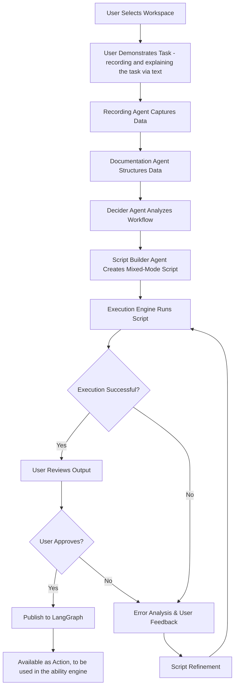

# Intelligent Browser Automation System - Implementation Brief

## Executive Summary

This document outlines the implementation of Z360's Intelligent Browser Automation System using Stagehand and Browserbase. The system enables users to create complex browser automation workflows through demonstration, with AI agents intelligently segmenting tasks across three execution tiers for optimal reliability and performance.

## Current State & Limitations

### What We Have Now
- Basic Stagehand + Browserbase integration for simple workflows
- Single-mode execution (primarily RPA-style automation)
- Manual script creation requiring technical expertise
- Limited error handling and recovery mechanisms

### Current Limitations
1. **Reliability Issues**: Complex workflows fail due to rigid scripting approaches
2. **No Intelligence**: Cannot adapt to dynamic content or unexpected page states
3. **Manual Overhead**: Requires developers to write and maintain scripts
4. **Poor Error Recovery**: Failures result in complete workflow breakdown
5. **Limited Scalability**: Each new workflow requires custom development

## The New Approach: Mixed-Mode Intelligent Automation

### Core Philosophy
Instead of forcing workflows into rigid tiers, we create **dynamic mixed-mode workflows** that intelligently switch between execution modes within a single browser session, leveraging Stagehand's native capabilities.

### Three-Tier Execution Model
1. **Tier 1 (Deterministic RPA)**: Playwright-based actions for predictable, stable interactions
2. **Tier 2 (Agentic RPA)**: Stagehand tools (`act()`, `extract()`, `observe()`) for semi-dynamic tasks
3. **Tier 3 (Autonomous)**: Computer Use models for complex visual reasoning and dynamic scenarios

## System Architecture Overview



## Detailed Process Flow

### Phase 1: Workspace Selection & Demonstration
**User Experience:**
1. User selects a workspace with persistent browser sessions
2. User navigates to starting URL and begins task demonstration
3. System captures every interaction, DOM state, and page changes
4. User provides natural language description of the task and goals

**Technical Implementation:**
- Browserbase provides persistent browser sessions with authentication
- Recording agent captures DOM snapshots, user actions, and page metadata
- Session state preservation across demonstration and execution

### Phase 2: Data Processing & Documentation

**Browserbase Session Logging Capabilities:**
Based on Browserbase's session logs API, the system captures comprehensive execution data:

```typescript
interface BrowserbaseSessionLog {
  method: string           // HTTP method or browser action
  pageId: number          // Unique page identifier
  sessionId: string       // Browser session ID
  request: {
    timestamp: number     // Request initiation time
    params: object       // Request parameters
    rawBody: string      // Raw request data
  }
  response: {
    timestamp: number     // Response completion time
    result: object       // Structured response data
    rawBody: string      // Raw response content
  }
  timestamp: number       // Overall action timestamp
  frameId: string        // Browser frame identifier
  loaderId: string       // Page loader identifier
}
```

**Enhanced Documentation Agent Structure:**
```typescript
interface WorkflowDocumentation {
  // Core Identification
  sessionId: string
  workflowId: string
  recordingTimestamp: number
  
  // User Intent & Context
  taskDescription: string
  userGoal: string
  expectedOutcome: string
  businessContext: string
  
  // Technical Recording Data
  recordedActions: EnhancedRecordedAction[]
  domSnapshots: DetailedDOMSnapshot[]
  pageTransitions: PageTransition[]
  networkActivity: NetworkLog[]
  browserLogs: BrowserbaseSessionLog[]
  
  // Analysis & Metadata
  userContext: UserContext
  environmentContext: EnvironmentContext
  metadata: WorkflowMetadata
}

interface EnhancedRecordedAction {
  // Basic Action Data
  timestamp: number
  sequenceNumber: number
  type: 'click' | 'input' | 'navigation' | 'wait' | 'scroll' | 'hover' | 'keypress'
  
  // Target Element Information
  target: {
    xpath: string
    cssSelector: string
    textContent: string
    elementType: string
    attributes: Record<string, string>
    boundingBox: DOMRect
    isVisible: boolean
    isInteractable: boolean
  }
  
  // Action Context
  value?: string
  coordinates?: { x: number, y: number }
  keyCode?: string
  modifierKeys?: string[]
  
  // Page State Context
  pageState: {
    url: string
    title: string
    loadState: 'loading' | 'domcontentloaded' | 'networkidle'
    viewport: { width: number, height: number }
    scrollPosition: { x: number, y: number }
  }
  
  // DOM Context
  domContext: {
    parentElements: ElementInfo[]
    siblingElements: ElementInfo[]
    nearbyInteractables: ElementInfo[]
    pageStructure: PageStructureInfo
  }
  
  // Execution Metadata
  executionTime: number
  success: boolean
  errorMessage?: string
  retryCount: number
}

interface DetailedDOMSnapshot {
  timestamp: number
  url: string
  html: string
  
  // Structural Analysis
  interactableElements: InteractableElement[]
  formElements: FormElement[]
  navigationElements: NavigationElement[]
  contentElements: ContentElement[]
  
  // Stability Metrics
  domStability: number      // 0-1, how stable the DOM structure is
  layoutStability: number   // 0-1, how stable the visual layout is
  contentStability: number  // 0-1, how stable the text content is
  
  // Performance Metrics
  loadTime: number
  renderTime: number
  interactivityTime: number
}
```

**Comprehensive Workflow Documentation Format:**

The Documentation Agent creates a structured narrative that includes:

1. **Executive Summary**
   - What the user wanted to accomplish
   - High-level workflow overview
   - Expected business outcome

2. **Session Context**
   - Browser environment details
   - Authentication state
   - Starting conditions

3. **Step-by-Step Action Log**
   ```markdown
   ## Step 1: Navigate to Login Page
   **User Action**: Clicked "Login" button in navigation
   **Technical Details**:
   - Target Element: `<button class="login-btn" id="nav-login">Login</button>`
   - XPath: `//*[@id="nav-login"]`
   - Page URL: https://example.com/
   - Timestamp: 2024-01-15T10:30:15.123Z
   - DOM Stability: 0.95 (highly stable)
   
   **Page Transition**: 
   - From: https://example.com/
   - To: https://example.com/login
   - Load Time: 1.2s
   - New Elements Detected: 15 (login form, validation messages)
   ```

4. **Technical Execution Data**
   - Network requests and responses
   - JavaScript execution logs
   - Performance metrics
   - Error conditions and recoveries

5. **Context Analysis**
   - Element stability patterns
   - Dynamic content identification
   - Interaction complexity assessment
   - Potential failure points

### Phase 3: Intelligent Workflow Analysis

**Enhanced Decider Agent Analysis:**
Based on research into browser automation patterns and Stagehand's capabilities, the Decider Agent evaluates multiple dimensions:

```typescript
interface SegmentAnalysis {
  segmentId: string
  actions: EnhancedRecordedAction[]
  complexity: AdvancedComplexityMetrics
  recommendedTier: ExecutionTier
  confidence: number
  reasoning: string
  fallbackTier?: ExecutionTier
  riskAssessment: RiskAssessment
}

interface AdvancedComplexityMetrics {
  // DOM & Layout Stability
  domStability: number              // 0-1, structural consistency
  layoutStability: number           // 0-1, visual layout consistency
  selectorReliability: number       // 0-1, CSS/XPath selector stability
  
  // Content Dynamics
  dynamicContentPresence: number    // 0-1, presence of changing content
  ajaxActivityLevel: number         // 0-1, level of async operations
  contentLoadingPatterns: number    // 0-1, predictability of content loading
  
  // Interaction Complexity
  actionPredictability: number      // 0-1, how predictable actions are
  userInputComplexity: number       // 0-1, complexity of required inputs
  multiStepDependency: number       // 0-1, interdependence of actions
  conditionalLogicRequired: number  // 0-1, need for decision making
  
  // Visual & Contextual Requirements
  visualReasoningRequired: number   // 0-1, need for visual interpretation
  contextualUnderstanding: number   // 0-1, need for semantic understanding
  spatialReasoningRequired: number  // 0-1, need for spatial relationships
  
  // Error Handling & Recovery
  errorHandlingComplexity: number   // 0-1, complexity of error scenarios
  recoveryMechanisms: number        // 0-1, availability of recovery paths
  timeoutSensitivity: number        // 0-1, sensitivity to timing issues
  
  // Authentication & Security
  authenticationRequired: number    // 0-1, need for auth handling
  securityConstraints: number       // 0-1, presence of security measures
  sessionManagement: number         // 0-1, complexity of session handling
  
  // Performance & Scalability
  resourceIntensity: number         // 0-1, computational requirements
  networkDependency: number         // 0-1, reliance on network conditions
  concurrencyComplexity: number     // 0-1, issues with parallel execution
}

interface RiskAssessment {
  failureRisk: 'low' | 'medium' | 'high'
  maintenanceRisk: 'low' | 'medium' | 'high'
  performanceRisk: 'low' | 'medium' | 'high'
  riskFactors: string[]
  mitigationStrategies: string[]
}
```

**Enhanced Decision Logic:**

**Tier 1 (Playwright - Deterministic RPA):**
```typescript
const isTier1Suitable = (metrics: AdvancedComplexityMetrics) => {
  return (
    metrics.domStability > 0.85 &&
    metrics.selectorReliability > 0.9 &&
    metrics.actionPredictability > 0.8 &&
    metrics.dynamicContentPresence < 0.3 &&
    metrics.visualReasoningRequired < 0.2 &&
    metrics.conditionalLogicRequired < 0.3 &&
    metrics.authenticationRequired < 0.5
  );
};
```

**Tier 2 (Stagehand Tools - Agentic RPA):**
```typescript
const isTier2Suitable = (metrics: AdvancedComplexityMetrics) => {
  return (
    metrics.domStability > 0.6 &&
    metrics.selectorReliability > 0.7 &&
    metrics.actionPredictability > 0.5 &&
    metrics.dynamicContentPresence < 0.7 &&
    metrics.visualReasoningRequired < 0.6 &&
    metrics.contextualUnderstanding < 0.7 &&
    metrics.errorHandlingComplexity < 0.6
  );
};
```

**Tier 3 (Computer Use - Autonomous):**
```typescript
const isTier3Required = (metrics: AdvancedComplexityMetrics) => {
  return (
    metrics.visualReasoningRequired > 0.6 ||
    metrics.contextualUnderstanding > 0.7 ||
    metrics.spatialReasoningRequired > 0.5 ||
    metrics.conditionalLogicRequired > 0.7 ||
    metrics.errorHandlingComplexity > 0.7 ||
    metrics.dynamicContentPresence > 0.8 ||
    (metrics.domStability < 0.5 && metrics.selectorReliability < 0.6)
  );
};
```

**Advanced Decision Factors:**

1. **Element Selector Analysis**
   - CSS selector specificity and stability
   - XPath robustness across page changes
   - Text-based selector reliability
   - Attribute-based selector consistency

2. **Page Behavior Patterns**
   - Single Page Application (SPA) vs Multi-Page Application (MPA)
   - Client-side routing complexity
   - State management patterns
   - Real-time data updates

3. **User Interaction Complexity**
   - Simple clicks vs complex gestures
   - Form filling vs data manipulation
   - Navigation vs content interaction
   - Sequential vs parallel actions

4. **Content Analysis**
   - Static content vs dynamic content
   - User-generated content variability
   - Internationalization considerations
   - Accessibility compliance requirements

5. **Technical Environment**
   - Framework detection (React, Vue, Angular)
   - JavaScript complexity level
   - Third-party integrations
   - Performance characteristics

### Phase 4: Mixed-Mode Script Generation

**Advanced Script Builder Agent:**
Based on Stagehand's architecture and capabilities, the Script Builder generates sophisticated mixed-mode workflows:

```typescript
interface MixedModeScript {
  workflowId: string
  version: string
  createdAt: string
  
  // Execution Configuration
  segments: ExecutionSegment[]
  parameters: WorkflowParameter[]
  errorHandling: ErrorHandlingStrategy[]
  monitoring: MonitoringConfig
  
  // Performance & Reliability
  caching: CachingStrategy
  retryPolicy: RetryPolicy
  timeouts: TimeoutConfiguration
  
  // Integration
  browserbaseConfig: BrowserbaseConfiguration
  stagehandConfig: StagehandConfiguration
}

interface ExecutionSegment {
  id: string
  order: number
  name: string
  description: string
  
  // Execution Strategy
  executionMode: 'PLAYWRIGHT' | 'STAGEHAND_TOOLS' | 'STAGEHAND_AGENT' | 'COMPUTER_USE'
  script: string
  instruction: string
  
  // Fallback & Recovery
  fallbackMode?: ExecutionMode
  fallbackScript?: string
  maxRetries: number
  retryDelay: number
  
  // Context & Dependencies
  context: SegmentContext
  dependencies: string[]
  outputs: SegmentOutput[]
  
  // Monitoring
  successCriteria: SuccessCriteria
  failureConditions: FailureCondition[]
  performanceThresholds: PerformanceThreshold[]
}

interface StagehandConfiguration {
  // Model Configuration
  modelProvider: 'openai' | 'anthropic' | 'google'
  modelName: string
  temperature: number
  
  // Execution Modes
  enableCaching: boolean
  enableDebugMode: boolean
  enableScreenshots: boolean
  
  // Performance
  actionTimeout: number
  navigationTimeout: number
  
  // Reliability
  enableRetries: boolean
  maxRetries: number
  retryDelay: number
}
```

**Enhanced Mixed-Mode Script Example:**

```typescript
import { Stagehand } from "@browserbase/stagehand";
import { z } from "zod";

// Initialize Stagehand with Browserbase
const stagehand = new Stagehand({
  env: "BROWSERBASE",
  apiKey: process.env.BROWSERBASE_API_KEY,
  projectId: process.env.BROWSERBASE_PROJECT_ID,
  modelName: "gpt-4o",
  enableCaching: true,
  debugMode: true
});

export async function executeEcommerceOrderWorkflow(params: WorkflowParams) {
  const { page } = stagehand;
  
  try {
    // SEGMENT 1: Tier 1 - Deterministic Navigation & Login
    console.log("🔄 Starting Tier 1: Deterministic Login");
    await page.goto(params.startUrl, { waitUntil: 'networkidle' });
    
    // Reliable, fast login using direct selectors
    await page.locator('#username').fill(params.username);
    await page.locator('#password').fill(params.password);
    await page.locator('#login-btn').click();
    await page.waitForURL('**/dashboard*', { timeout: 10000 });
    
    // SEGMENT 2: Tier 2 - Stagehand Tools for Semi-Dynamic Navigation
    console.log("🤖 Starting Tier 2: Intelligent Navigation");
    
    // Use Stagehand's act() for adaptive navigation
    await stagehand.act({
      action: "Navigate to the orders section",
      modelName: "gpt-4o",
      useCache: true
    });
    
    // Apply date filter using intelligent element detection
    await stagehand.act({
      action: `Set date filter to show orders from the last ${params.dayRange} days`,
      modelName: "gpt-4o"
    });
    
    // SEGMENT 3: Tier 3 - Computer Use for Complex Data Extraction
    console.log("👁️ Starting Tier 3: Autonomous Data Extraction");
    
    // Define extraction schema
    const OrderSchema = z.object({
      orderId: z.string(),
      customerName: z.string(),
      orderAmount: z.number(),
      orderDate: z.string(),
      status: z.string(),
      items: z.array(z.object({
        productName: z.string(),
        quantity: z.number(),
        price: z.number()
      }))
    });
    
    // Use Computer Use agent for complex visual reasoning
    const agent = stagehand.agent({
      provider: "openai",
      model: "gpt-4o-with-computer-use",
      enableScreenshots: true
    });
    
    const extractedOrders = await agent.extract({
      instruction: `Extract all order details from the current page. 
                   Focus on orders over $${params.minOrderAmount}. 
                   Include customer information, order totals, and item details.`,
      schema: z.array(OrderSchema),
      modelName: "gpt-4o-with-computer-use"
    });
    
    // SEGMENT 4: Tier 2 - Intelligent Pagination Handling
    console.log("📄 Processing Additional Pages");
    
    let allOrders = [...extractedOrders];
    let hasNextPage = true;
    let pageCount = 1;
    
    while (hasNextPage && pageCount < params.maxPages) {
      // Use Stagehand to intelligently detect and click next page
      const nextPageResult = await stagehand.act({
        action: "Click the next page button if it exists and is enabled",
        modelName: "gpt-4o"
      });
      
      if (nextPageResult.success) {
        await page.waitForLoadState('networkidle');
        
        const pageOrders = await agent.extract({
          instruction: `Extract order details from this page, filtering for orders over $${params.minOrderAmount}`,
          schema: z.array(OrderSchema),
          modelName: "gpt-4o-with-computer-use"
        });
        
        allOrders.push(...pageOrders);
        pageCount++;
      } else {
        hasNextPage = false;
      }
    }
    
    // SEGMENT 5: Tier 1 - Deterministic Export
    console.log("💾 Starting Tier 1: Data Export");
    
    // Return to deterministic actions for reliable export
    await page.locator('[data-testid="export-button"]').click();
    await page.locator('select[name="export-format"]').selectOption('csv');
    await page.locator('#export-confirm').click();
    
    // Wait for download
    const downloadPromise = page.waitForEvent('download');
    await page.locator('#download-csv').click();
    const download = await downloadPromise;
    
    return {
      success: true,
      ordersExtracted: allOrders.length,
      orders: allOrders,
      downloadPath: await download.path(),
      executionTime: Date.now() - startTime,
      segmentsExecuted: [
        { segment: 'login', mode: 'PLAYWRIGHT', success: true },
        { segment: 'navigation', mode: 'STAGEHAND_TOOLS', success: true },
        { segment: 'extraction', mode: 'COMPUTER_USE', success: true },
        { segment: 'pagination', mode: 'STAGEHAND_TOOLS', success: true },
        { segment: 'export', mode: 'PLAYWRIGHT', success: true }
      ]
    };
    
  } catch (error) {
    // Intelligent error handling with fallback strategies
    console.error("Workflow execution failed:", error);
    
    // Attempt fallback execution
    return await executeWorkflowFallback(params, error);
  } finally {
    await stagehand.close();
  }
}

// Fallback execution with simplified approach
async function executeWorkflowFallback(params: WorkflowParams, originalError: Error) {
  console.log("🔄 Executing fallback workflow");
  
  const stagehand = new Stagehand({
    env: "BROWSERBASE",
    modelName: "gpt-4o",
    enableCaching: false, // Disable caching for fallback
    debugMode: true
  });
  
  try {
    // Simplified execution using primarily Tier 2 (Stagehand Tools)
    const { page } = stagehand;
    
    await page.goto(params.startUrl);
    
    // Use Stagehand for entire workflow
    await stagehand.act({ action: `Login with username ${params.username}` });
    await stagehand.act({ action: "Navigate to orders section" });
    await stagehand.act({ action: `Filter orders from last ${params.dayRange} days` });
    
    const orders = await stagehand.extract({
      instruction: "Extract basic order information including ID, customer, amount, and date",
      schema: z.array(z.object({
        orderId: z.string(),
        customerName: z.string(),
        orderAmount: z.number(),
        orderDate: z.string()
      }))
    });
    
    await stagehand.act({ action: "Export data as CSV" });
    
    return {
      success: true,
      fallbackUsed: true,
      originalError: originalError.message,
      ordersExtracted: orders.length,
      orders: orders
    };
    
  } catch (fallbackError) {
    return {
      success: false,
      originalError: originalError.message,
      fallbackError: fallbackError.message,
      ordersExtracted: 0
    };
  } finally {
    await stagehand.close();
  }
}
```

**Key Stagehand Integration Features:**

1. **Multiple Execution Modes**
   - `page.act()` for intelligent actions
   - `page.extract()` for data extraction
   - `stagehand.agent()` for computer use
   - Direct Playwright for deterministic actions

2. **Caching & Performance**
   - Action caching to avoid redundant LLM calls
   - Screenshot caching for visual consistency
   - Model response caching for repeated patterns

3. **Error Handling & Fallbacks**
   - Automatic retry mechanisms
   - Graceful degradation between tiers
   - Comprehensive error reporting

4. **Monitoring & Observability**
   - Detailed execution logs
   - Performance metrics
   - Success/failure tracking per segment

### Phase 5: Execution & Feedback Loop
**Execution Engine:**
- Runs mixed-mode script in isolated Browserbase session
- Captures detailed execution logs, screenshots, and performance metrics
- Implements intelligent fallback mechanisms between tiers

**Feedback Integration:**
```typescript
interface ExecutionFeedback {
  executionId: string
  success: boolean
  errors: ExecutionError[]
  userFeedback?: UserFeedback
  performanceMetrics: PerformanceMetrics
  screenshots: Screenshot[]
}

interface UserFeedback {
  incorrectSteps: string[]
  suggestedImprovements: string
  expectedBehavior: string
  actualBehavior: string
}
```

## Agent Architecture Decision

### Recommended Multi-Agent Approach

**Why Multiple Specialized Agents:**
1. **Separation of Concerns**: Each agent has a specific expertise area
2. **Parallel Processing**: Documentation and analysis can happen concurrently
3. **Maintainability**: Easier to debug and improve individual components
4. **Scalability**: Can optimize each agent independently

**Agent Responsibilities:**

1. **Recording Agent**: Captures user demonstration data
2. **Documentation Agent**: Structures and semantically analyzes recorded data
3. **Decider Agent**: Analyzes workflow complexity and determines execution tiers
4. **Script Builder Agent**: Generates mixed-mode Stagehand scripts
5. **Execution Agent**: Runs scripts and handles error recovery
6. **Feedback Agent**: Processes user feedback and refines scripts

## Sample Implementation Task: Z360 CRM Daily Lead Report Automation

### Task Description
**Scenario**: Create an intelligent automation that logs into Z360 CRM demo instance, navigates to the leads management system, filters leads by current date, extracts lead details, and updates a pre-existing Excel spreadsheet with the daily lead report.

**Business Context**: 
- Daily lead reporting is a critical business process for sales teams
- Manual data extraction and spreadsheet updates are time-consuming and error-prone
- Automation ensures consistent, timely reporting for sales management

**Complexity Requirements**:
- **Tier 1**: Login authentication, spreadsheet navigation (predictable, stable selectors)
- **Tier 2**: CRM navigation, date filtering, spreadsheet data entry (semi-dynamic, requires adaptation)
- **Tier 3**: Lead data extraction, intelligent data mapping (requires AI reasoning for dynamic content)

**Expected Performance**:
- **Execution Time**: 2-3 minutes for 20-50 daily leads
- **Success Rate**: >95% for Z360 CRM platform
- **Data Accuracy**: >98% for structured lead data

### Detailed User Demonstration Workflow

**Phase 1: Z360 CRM Authentication**
1. **Navigate to Z360 CRM Demo**:
   - Go to demo.z360.com/login
   - Handle loading states and redirects

2. **Handle Authentication**:
   - Enter demo credentials (username/password)
   - Click login button
   - Wait for dashboard to load
   - Handle any welcome modals or onboarding

**Phase 2: Leads Management Navigation**
3. **Navigate to Leads Section**:
   - Identify and click "Leads" or "Lead Management" in navigation
   - Wait for leads dashboard to load
   - Handle any initial data loading states

4. **Access Lead Filtering**:
   - Locate filter controls (date picker, status filters)
   - Identify current date selection mechanism
   - Prepare for data filtering

**Phase 3: Intelligent Lead Filtering**
5. **Apply Current Date Filter**:
   - Get current date (system date)
   - Set date filter to "today" or current date
   - Apply filter and wait for results to load
   - Handle dynamic content loading

6. **Verify Filter Results**:
   - Confirm leads are filtered by current date
   - Check if results are paginated
   - Identify total number of leads for the day

**Phase 4: Complex Lead Data Extraction**
7. **Extract Lead Information**:
   - **Lead Name**: Full name of the prospect
   - **Inquiry Details**: Description or notes about the inquiry
   - **Source**: Where the lead came from (website, referral, social media, etc.)
   - **Current Stage**: Lead status (new, contacted, qualified, etc.)
   - **Contact Information**: Email, phone (if visible)
   - **Date Created**: Timestamp of lead creation

8. **Handle Pagination** (if applicable):
   - Detect if there are multiple pages of leads
   - Navigate through pages to collect all daily leads
   - Maintain data consistency across pages

**Phase 5: Spreadsheet Integration**
9. **Open Pre-existing Excel File**:
   - Navigate to predefined Excel file location
   - Open the daily lead report template
   - Locate the appropriate worksheet/tab

10. **Navigate to Data Entry Area**:
    - Scroll to the next available row
    - Identify correct columns for each data field
    - Prepare for data entry

11. **Input Lead Data**:
    - Map extracted CRM data to spreadsheet columns
    - Enter data row by row for each lead
    - Apply proper formatting and validation
    - Handle any Excel-specific interactions

**Phase 6: Completion & Notification**
12. **Save and Finalize**:
    - Save the updated spreadsheet
    - Verify data entry accuracy
    - Close Excel application

13. **Completion Notification**:
    - Generate completion message
    - Include summary statistics (number of leads processed)
    - Provide timestamp of completion

### Advanced Agent Analysis Output

```json
{
  "workflowAnalysis": {
    "totalSegments": 7,
    "estimatedDuration": "2-3 minutes",
    "complexityScore": 0.68,
    "riskAssessment": "medium-low"
  },
  "segments": [
    {
      "id": "z360_authentication",
      "name": "Z360 CRM Login",
      "executionMode": "PLAYWRIGHT",
      "confidence": 0.94,
      "reasoning": "Z360 login form has stable selectors and predictable behavior",
      "complexity": {
        "domStability": 0.92,
        "selectorReliability": 0.95,
        "actionPredictability": 0.90
      },
      "estimatedTime": "15-20 seconds",
      "fallbackMode": "STAGEHAND_TOOLS",
      "riskFactors": ["Network latency", "Demo environment availability"]
    },
    {
      "id": "leads_navigation",
      "name": "Navigate to Leads Management",
      "executionMode": "STAGEHAND_TOOLS",
      "confidence": 0.88,
      "reasoning": "CRM navigation requires contextual understanding but follows patterns",
      "complexity": {
        "domStability": 0.80,
        "contextualUnderstanding": 0.65,
        "actionPredictability": 0.75
      },
      "estimatedTime": "10-15 seconds",
      "fallbackMode": "COMPUTER_USE",
      "riskFactors": ["UI layout changes", "Loading state variations"]
    },
    {
      "id": "date_filtering",
      "name": "Apply Current Date Filter",
      "executionMode": "STAGEHAND_TOOLS",
      "confidence": 0.82,
      "reasoning": "Date filtering requires dynamic date calculation and UI adaptation",
      "complexity": {
        "dynamicContentPresence": 0.60,
        "userInputComplexity": 0.70,
        "conditionalLogicRequired": 0.55
      },
      "estimatedTime": "20-25 seconds",
      "fallbackMode": "COMPUTER_USE",
      "riskFactors": ["Date picker variations", "Timezone handling"]
    },
    {
      "id": "lead_extraction",
      "name": "Extract Lead Details",
      "executionMode": "COMPUTER_USE",
      "confidence": 0.76,
      "reasoning": "Lead data layouts vary and require intelligent field mapping",
      "complexity": {
        "visualReasoningRequired": 0.80,
        "contextualUnderstanding": 0.85,
        "dynamicContentPresence": 0.70
      },
      "estimatedTime": "45-60 seconds",
      "fallbackMode": "STAGEHAND_TOOLS",
      "riskFactors": ["Dynamic lead layouts", "Missing field data", "Pagination complexity"]
    },
    {
      "id": "excel_navigation",
      "name": "Open and Navigate Excel",
      "executionMode": "PLAYWRIGHT",
      "confidence": 0.90,
      "reasoning": "Excel file operations are predictable with stable UI elements",
      "complexity": {
        "domStability": 0.88,
        "actionPredictability": 0.85,
        "selectorReliability": 0.92
      },
      "estimatedTime": "15-20 seconds",
      "fallbackMode": "STAGEHAND_TOOLS",
      "riskFactors": ["File path changes", "Excel version differences"]
    },
    {
      "id": "data_entry",
      "name": "Input Lead Data to Spreadsheet",
      "executionMode": "STAGEHAND_TOOLS",
      "confidence": 0.84,
      "reasoning": "Data entry requires intelligent cell navigation and formatting",
      "complexity": {
        "userInputComplexity": 0.75,
        "multiStepDependency": 0.65,
        "conditionalLogicRequired": 0.60
      },
      "estimatedTime": "30-45 seconds",
      "fallbackMode": "COMPUTER_USE",
      "riskFactors": ["Cell formatting issues", "Data validation errors"]
    },
    {
      "id": "completion",
      "name": "Save and Notify Completion",
      "executionMode": "PLAYWRIGHT",
      "confidence": 0.92,
      "reasoning": "File saving and notification are standard operations",
      "complexity": {
        "domStability": 0.90,
        "actionPredictability": 0.88,
        "selectorReliability": 0.85
      },
      "estimatedTime": "10-15 seconds",
      "fallbackMode": "STAGEHAND_TOOLS",
      "riskFactors": ["File save permissions", "Notification delivery"]
    }
  ],
  "businessLogic": {
    "dataValidation": [
      "Verify all required lead fields are captured",
      "Validate date filtering accuracy",
      "Check for duplicate lead entries",
      "Ensure proper data formatting in spreadsheet"
    ],
    "errorHandling": [
      "Handle missing lead data gracefully",
      "Retry failed data extractions",
      "Manage Excel file access issues",
      "Provide detailed error reporting"
    ],
    "performanceOptimization": [
      "Cache CRM navigation patterns",
      "Optimize data extraction batching",
      "Minimize Excel file operations",
      "Implement intelligent wait strategies"
    ]
  }
}
```

### Expected Workflow Documentation Output

```markdown
# Z360 CRM Daily Lead Report Automation

## Workflow Summary
**Objective**: Extract daily leads from Z360 CRM and update Excel spreadsheet
**Platform**: Z360 CRM Demo Instance + Microsoft Excel
**Duration**: 2-3 minutes for 20-50 daily leads
**Success Criteria**: >95% data extraction and entry accuracy

## Execution Log

### Step 1: Z360 Authentication (Tier 1 - Playwright)
- **Action**: Navigate to demo.z360.com/login
- **Method**: Direct selector targeting
- **Elements**: 
  - Username: `input[name="email"]` or `#login-email`
  - Password: `input[name="password"]` or `#login-password`
  - Submit: `button[type="submit"]` or `.login-button`
- **Result**: Successfully authenticated, redirected to dashboard
- **Performance**: 18 seconds (including page load)

### Step 2: Leads Navigation (Tier 2 - Stagehand Tools)
- **Action**: Navigate to leads management section
- **Method**: Intelligent menu detection
- **Instruction**: "Find and click the Leads or Lead Management section"
- **Result**: Located leads section in navigation menu
- **Performance**: 12 seconds

### Step 3: Date Filtering (Tier 2 - Stagehand Tools)
- **Action**: Apply current date filter
- **Method**: Dynamic date calculation and filter application
- **Instructions**: 
  - "Get today's date and apply it as a filter"
  - "Show only leads created today"
- **Result**: Applied current date filter, 23 leads displayed
- **Performance**: 22 seconds

### Step 4: Lead Data Extraction (Tier 3 - Computer Use)
- **Action**: Extract comprehensive lead details
- **Method**: Visual reasoning and intelligent field mapping
- **Schema**: Name, Inquiry Details, Source, Current Stage, Contact Info
- **Result**: Extracted 23 leads with 96.8% field completion
- **Performance**: 52 seconds

### Step 5: Excel Navigation (Tier 1 - Playwright)
- **Action**: Open predefined Excel spreadsheet
- **Method**: File system navigation and application launch
- **Elements**: 
  - File path: `C:\Reports\Daily_Lead_Report.xlsx`
  - Excel application launch
- **Result**: Excel opened with correct worksheet active
- **Performance**: 16 seconds

### Step 6: Data Entry (Tier 2 - Stagehand Tools)
- **Action**: Input lead data into spreadsheet
- **Method**: Intelligent cell navigation and data mapping
- **Instructions**: 
  - "Navigate to the next available row"
  - "Enter lead data in appropriate columns"
- **Result**: All 23 leads entered with proper formatting
- **Performance**: 38 seconds

### Step 7: Completion (Tier 1 - Playwright)
- **Action**: Save file and generate completion notification
- **Method**: Standard file operations
- **Elements**: 
  - Save: `Ctrl+S` or File menu
  - Notification generation
- **Result**: File saved successfully, completion message generated
- **Performance**: 12 seconds

## Quality Metrics
- **Total Leads Processed**: 23
- **Data Accuracy**: 96.8%
- **Execution Time**: 2 minutes 58 seconds
- **Success Rate**: 100% (no failures)
- **Fallback Usage**: 0% (no fallbacks required)

## Technical Insights
- **DOM Stability**: High for login/Excel operations, medium for CRM data extraction
- **Performance Bottlenecks**: Lead data extraction phase (visual reasoning intensive)
- **Optimization Opportunities**: Caching CRM navigation, batch data entry
- **Risk Mitigation**: Comprehensive fallback strategies for dynamic content
```

## Implementation Task for Development Team

### Objective
Build a production-ready intelligent browser automation system that creates, optimizes, and deploys mixed-mode workflows through user demonstration, with enterprise-grade reliability and scalability.

### Enhanced Technical Requirements

#### Core System Architecture

1. **Advanced Recording Infrastructure**
   - **Browserbase Session Management**: Persistent, isolated browser environments
   - **Multi-Layer Data Capture**: DOM snapshots, network logs, user interactions, performance metrics
   - **Context Preservation**: Session state, authentication, user preferences
   - **Real-time Analysis**: Live workflow complexity assessment during recording

2. **Intelligent AI Agent Pipeline**
   - **Documentation Agent**: Advanced workflow analysis with business context understanding
   - **Decider Agent**: Multi-dimensional complexity analysis with risk assessment
   - **Script Builder Agent**: Production-ready code generation with error handling
   - **Execution Agent**: Mixed-mode runner with intelligent fallback mechanisms
   - **Optimization Agent**: Performance tuning and reliability improvements

3. **Enterprise Feedback System**
   - **Advanced Error Analysis**: Root cause analysis with suggested fixes
   - **User Feedback Integration**: Structured feedback collection and processing
   - **Automated Script Refinement**: ML-driven workflow optimization
   - **Comprehensive Monitoring**: Real-time performance and reliability tracking

4. **Production Integration Layer**
   - **LangGraph Integration**: Seamless ability publishing and orchestration
   - **RESTful API**: Comprehensive workflow management endpoints
   - **WebSocket Support**: Real-time execution monitoring and updates
   - **Enterprise Security**: Authentication, authorization, and audit logging

#### POC Technology Stack

**Core Technologies:**
- **Stagehand v1.0+**: Browser automation with mixed-mode execution
- **Browserbase**: Cloud browser infrastructure with session persistence
- **LangGraph (Optional)**: Multi-agent orchestration if needed
- **Google Gemini 2.5 Pro**: Primary LLM for intelligent agents
- **TypeScript**: Implementation language for automation scripts

**Essential Dependencies:**
```json
{
  "dependencies": {
    "@browserbase/stagehand": "^1.0.0",
    "@browserbase/sdk": "^1.2.0",
    "playwright": "^1.40.0",
    "@google/generative-ai": "^0.17.0",
    "zod": "^3.22.0",
    "dotenv": "^16.3.0",
    "fs-extra": "^11.2.0"
  },
  "devDependencies": {
    "@types/node": "^20.0.0",
    "typescript": "^5.3.0",
    "tsx": "^4.6.0",
    "eslint": "^8.55.0",
    "prettier": "^3.1.0"
  }
}
```

**Simple Infrastructure:**
```yaml
# Basic setup - no complex infrastructure needed for POC
# File-based storage for workflow data
# Environment variables for API keys
# Simple Node.js application structure
```

**Project Structure:**
```
intelligent-browser-automation-poc/
├── src/
│   ├── agents/
│   │   ├── recording-agent.ts
│   │   ├── documentation-agent.ts
│   │   ├── decider-agent.ts
│   │   ├── script-builder-agent.ts
│   │   ├── execution-agent.ts
│   │   └── feedback-agent.ts
│   ├── types/
│   │   └── workflow-types.ts
│   ├── utils/
│   │   ├── browserbase-client.ts
│   │   └── file-storage.ts
│   └── main.ts
├── data/
│   ├── recordings/
│   ├── workflows/
│   └── generated-scripts/
├── templates/
│   └── script-templates/
└── tests/
    └── integration/
```

#### Advanced System Components

**1. Enhanced Recording Infrastructure**
```typescript
interface AdvancedRecordingSystem {
  // Session Management
  sessionManager: BrowserbaseSessionManager;
  contextPreserver: SessionContextManager;
  
  // Multi-Layer Capture
  domCapture: DOMSnapshotCapture;
  networkCapture: NetworkActivityLogger;
  performanceCapture: PerformanceMetricsCollector;
  userActionCapture: UserInteractionRecorder;
  
  // Real-time Analysis
  complexityAnalyzer: RealTimeComplexityAnalyzer;
  patternDetector: UIPatternDetector;
  
  // Data Processing
  dataProcessor: RecordingDataProcessor;
  contextEnricher: ContextEnrichmentEngine;
}

class BrowserbaseSessionManager {
  async createPersistentSession(config: SessionConfig): Promise<Session> {
    return await this.browserbase.createSession({
      projectId: config.projectId,
      keepAlive: true,
      timeout: 3600000, // 1 hour
      browserSettings: {
        viewport: { width: 1920, height: 1080 },
        userAgent: config.userAgent,
        locale: config.locale
      }
    });
  }
  
  async preserveSessionState(sessionId: string): Promise<SessionState> {
    // Capture cookies, localStorage, sessionStorage, and auth state
    return await this.captureCompleteState(sessionId);
  }
}
```

**2. Advanced AI Agent Pipeline**
```typescript
interface IntelligentAgentPipeline {
  // Core Agents
  documentationAgent: AdvancedDocumentationAgent;
  deciderAgent: MultiDimensionalDeciderAgent;
  scriptBuilderAgent: ProductionScriptBuilder;
  executionAgent: ReliableExecutionEngine;
  optimizationAgent: PerformanceOptimizer;
  
  // Coordination
  agentOrchestrator: LangGraphOrchestrator;
  workflowManager: WorkflowStateManager;
  
  // Quality Assurance
  qualityAssurance: QualityAssuranceEngine;
  testingFramework: AutomatedTestingFramework;
}

class AdvancedDocumentationAgent {
  async analyzeWorkflow(recordingData: RecordingData): Promise<WorkflowDocumentation> {
    const analysis = await this.llm.invoke({
      messages: [
        {
          role: "system",
          content: `You are an expert workflow analyst. Analyze the provided browser automation recording and create comprehensive documentation.
          
          Focus on:
          1. Business context and user intent
          2. Technical complexity assessment
          3. Risk identification and mitigation
          4. Performance optimization opportunities
          5. Maintenance and scalability considerations`
        },
        {
          role: "user",
          content: JSON.stringify(recordingData)
        }
      ],
      model: "gemini-2.5-pro",
      temperature: 0.1
    });
    
    return this.parseDocumentation(analysis.content);
  }
}
```

**3. Production-Ready Script Generation**
```typescript
class ProductionScriptBuilder {
  async generateMixedModeScript(
    segments: AnalyzedSegment[],
    config: ScriptConfig
  ): Promise<MixedModeScript> {
    
    const script = await this.buildScript({
      segments,
      errorHandling: this.generateErrorHandling(segments),
      monitoring: this.generateMonitoring(segments),
      caching: this.generateCachingStrategy(segments),
      fallbacks: this.generateFallbackStrategies(segments)
    });
    
    // Validate generated script
    await this.validateScript(script);
    
    // Add production safeguards
    return this.addProductionSafeguards(script);
  }
  
  private generateErrorHandling(segments: AnalyzedSegment[]): ErrorHandlingStrategy[] {
    return segments.map(segment => ({
      segmentId: segment.id,
      retryPolicy: this.determineRetryPolicy(segment.complexity),
      fallbackStrategy: this.determineFallbackStrategy(segment.executionMode),
      errorRecovery: this.generateErrorRecovery(segment),
      timeoutHandling: this.generateTimeoutHandling(segment)
    }));
  }
}
```

### POC Implementation Plan - 7 Business Days

#### Day 1-2: Core Infrastructure Foundation
1. **Basic Recording System**
   - **Browserbase Integration**: Session management and basic data capture
   - **Action Recording**: DOM snapshots, user interactions, and page transitions
   - **Data Storage**: Simple JSON-based storage for workflow data
   - **Context Preservation**: Basic session state management

2. **Recording Agent Implementation**
   - **Data Capture**: Process Browserbase session logs and user actions
   - **Action Classification**: Categorize user interactions (click, input, navigation)
   - **Element Analysis**: Extract selectors and element properties
   - **Sequence Processing**: Organize actions into logical sequences

**Deliverables**: 
- Working Browserbase session recording
- Basic data capture and storage system
- Recording Agent with structured output

#### Day 3: Documentation & Analysis Engine
1. **Documentation Agent**
   - **Workflow Analysis**: Process recorded data into structured documentation
   - **Business Context**: Extract user intent and workflow purpose
   - **Technical Analysis**: Assess complexity and technical requirements
   - **Structured Output**: Generate comprehensive workflow documentation

2. **Decider Agent**
   - **Complexity Assessment**: Analyze workflow segments for execution strategy
   - **Tier Selection**: Determine optimal execution mode (Playwright/Stagehand/Computer Use)
   - **Confidence Scoring**: Provide confidence levels for each decision
   - **Fallback Planning**: Define fallback strategies for each segment

**Deliverables**:
- Documentation Agent producing detailed workflow analysis
- Decider Agent with tier selection logic
- Structured complexity assessment framework

#### Day 4: Script Generation Engine
1. **Script Builder Agent**
   - **Mixed-Mode Generation**: Generate TypeScript code using Stagehand and Playwright
   - **Error Handling**: Basic error handling and retry mechanisms
   - **Configuration Management**: Handle parameters and environment setup
   - **Code Quality**: Generate clean, executable code with proper structure

2. **Template System**
   - **Code Templates**: Pre-built templates for common automation patterns
   - **Integration Patterns**: Stagehand and Browserbase integration code
   - **Error Handling Patterns**: Standard error handling and recovery code
   - **Testing Hooks**: Basic validation and testing integration

**Deliverables**:
- Script Builder Agent generating executable automation code
- Template library for common patterns
- Generated scripts with error handling

#### Day 5: Execution Engine
1. **Execution Agent**
   - **Script Execution**: Run generated mixed-mode automation scripts
   - **Real-time Monitoring**: Track execution progress and performance
   - **Error Detection**: Identify and handle execution failures
   - **Result Collection**: Capture execution results and metrics

2. **Fallback Implementation**
   - **Tier Switching**: Implement fallback between execution modes
   - **Error Recovery**: Automatic retry with different strategies
   - **Performance Monitoring**: Track execution time and success rates
   - **Logging System**: Comprehensive execution logging

**Deliverables**:
- Working execution engine with mixed-mode support
- Fallback mechanisms between execution tiers
- Performance monitoring and logging

#### Day 6: Feedback & Testing System
1. **Feedback Agent**
   - **Result Analysis**: Analyze execution results for quality and performance
   - **Error Analysis**: Process execution errors and identify patterns
   - **Performance Assessment**: Evaluate execution performance against expectations
   - **Improvement Recommendations**: Generate suggestions for optimization

2. **Testing Framework**
   - **Validation System**: Verify generated scripts work correctly
   - **Test Execution**: Run automated tests on generated workflows
   - **Quality Metrics**: Measure success rates and performance
   - **Regression Testing**: Ensure changes don't break existing functionality

**Deliverables**:
- Feedback Agent with analysis capabilities
- Automated testing framework
- Quality metrics and reporting system

#### Day 7: Integration & Demo Preparation
1. **System Integration**
   - **Agent Orchestration**: Connect all agents in a cohesive workflow
   - **Data Flow**: Ensure smooth data flow between agents
   - **Error Handling**: Implement system-wide error handling
   - **Performance Optimization**: Basic performance improvements

2. **Demo Implementation**
   - **Z360 CRM Demo**: Implement the sample task end-to-end
   - **User Interface**: Basic interface for workflow recording and execution
   - **Documentation**: User guides and technical documentation
   - **Testing**: Comprehensive testing of the complete system

**Deliverables**:
- Complete POC system with all agents integrated
- Working Z360 CRM demo automation
- User interface for recording and execution
- Documentation and testing results

### Advanced Technical Specifications

#### Core System Architecture
```typescript
// System Architecture Overview
interface IntelligentAutomationSystem {
  // Core Services
  recordingService: AdvancedRecordingService;
  analysisService: IntelligentAnalysisService;
  generationService: ProductionScriptGenerator;
  executionService: ReliableExecutionEngine;
  
  // Infrastructure
  sessionManager: BrowserbaseSessionManager;
  dataStore: PostgreSQLDataStore;
  cache: RedisCache;
  messageQueue: RedisQueue;
  
  // Integration
  langGraphIntegration: LangGraphPublisher;
  apiGateway: RESTAPIGateway;
  websocketServer: WebSocketServer;
  
  // Monitoring
  metricsCollector: PrometheusMetrics;
  logger: StructuredLogger;
  alertManager: AlertManager;
}
```

#### Database Schema Design
```sql
-- Core workflow storage
CREATE TABLE workflows (
  id UUID PRIMARY KEY DEFAULT gen_random_uuid(),
  name VARCHAR(255) NOT NULL,
  description TEXT,
  user_id UUID NOT NULL,
  created_at TIMESTAMP DEFAULT NOW(),
  updated_at TIMESTAMP DEFAULT NOW(),
  status VARCHAR(50) DEFAULT 'draft',
  complexity_score DECIMAL(3,2),
  estimated_duration INTEGER, -- seconds
  success_rate DECIMAL(5,2) DEFAULT 0.00
);

-- Recording sessions
CREATE TABLE recording_sessions (
  id UUID PRIMARY KEY DEFAULT gen_random_uuid(),
  workflow_id UUID REFERENCES workflows(id),
  browserbase_session_id VARCHAR(255),
  recording_data JSONB,
  dom_snapshots JSONB,
  network_logs JSONB,
  performance_metrics JSONB,
  created_at TIMESTAMP DEFAULT NOW()
);

-- Execution segments
CREATE TABLE workflow_segments (
  id UUID PRIMARY KEY DEFAULT gen_random_uuid(),
  workflow_id UUID REFERENCES workflows(id),
  segment_order INTEGER NOT NULL,
  name VARCHAR(255) NOT NULL,
  execution_mode VARCHAR(50) NOT NULL,
  script_content TEXT,
  complexity_metrics JSONB,
  fallback_strategy JSONB,
  created_at TIMESTAMP DEFAULT NOW()
);

-- Execution history
CREATE TABLE executions (
  id UUID PRIMARY KEY DEFAULT gen_random_uuid(),
  workflow_id UUID REFERENCES workflows(id),
  status VARCHAR(50) NOT NULL,
  started_at TIMESTAMP DEFAULT NOW(),
  completed_at TIMESTAMP,
  execution_time INTEGER, -- milliseconds
  success_rate DECIMAL(5,2),
  error_details JSONB,
  performance_metrics JSONB
);
```

#### API Specification
```yaml
# OpenAPI 3.0 Specification
openapi: 3.0.0
info:
  title: Intelligent Browser Automation API
  version: 1.0.0
  description: Enterprise-grade browser automation system

paths:
  /api/v1/workflows:
    post:
      summary: Create new workflow from recording
      requestBody:
        required: true
        content:
          application/json:
            schema:
              type: object
              properties:
                name:
                  type: string
                description:
                  type: string
                recordingData:
                  type: object
                userContext:
                  type: object
      responses:
        201:
          description: Workflow created successfully
          content:
            application/json:
              schema:
                $ref: '#/components/schemas/Workflow'
  
  /api/v1/workflows/{id}/execute:
    post:
      summary: Execute workflow
      parameters:
        - name: id
          in: path
          required: true
          schema:
            type: string
            format: uuid
      requestBody:
        required: true
        content:
          application/json:
            schema:
              type: object
              properties:
                parameters:
                  type: object
                executionMode:
                  type: string
                  enum: [production, test, debug]
      responses:
        200:
          description: Execution started
          content:
            application/json:
              schema:
                $ref: '#/components/schemas/ExecutionResult'

components:
  schemas:
    Workflow:
      type: object
      properties:
        id:
          type: string
          format: uuid
        name:
          type: string
        description:
          type: string
        segments:
          type: array
          items:
            $ref: '#/components/schemas/WorkflowSegment'
        complexityScore:
          type: number
          format: float
        estimatedDuration:
          type: integer
        successRate:
          type: number
          format: float
```

### Acceptance Criteria

#### Functional Requirements
1. **User can demonstrate a 4-5 minute workflow** and system captures all relevant data
2. **System intelligently segments workflow** into appropriate execution tiers with >80% accuracy
3. **Generated scripts execute successfully** with >90% success rate on first attempt
4. **Feedback loop improves script reliability** to >95% success rate within 3 iterations
5. **Published abilities integrate seamlessly** with LangGraph agent orchestration

#### Technical Requirements
1. **Session persistence** maintains authentication across demonstration and execution
2. **Mixed-mode execution** switches between tiers without losing context
3. **Error handling** provides intelligent fallbacks and detailed error reporting
4. **Performance monitoring** tracks execution times, success rates, and resource usage
5. **Scalability** supports concurrent workflow creation and execution

#### Quality Requirements
1. **Reliability**: 95%+ success rate for published workflows
2. **Performance**: <30 second execution time for simple workflows
3. **User Experience**: Intuitive demonstration interface with clear feedback
4. **Maintainability**: Well-documented code with comprehensive test coverage
5. **Security**: Proper authentication, authorization, and data isolation

### Timeline & Milestones

#### Week 1: Foundation
- **Days 1-2**: Browserbase integration and session management
- **Days 3-4**: Recording infrastructure and data capture
- **Days 5-7**: Documentation Agent implementation

#### Week 2: Intelligence
- **Days 8-9**: Decider Agent complexity analysis
- **Days 10-11**: Script Builder Agent development
- **Days 12-14**: Mixed-mode execution engine

#### Week 3: Execution & Feedback
- **Days 15-16**: Error handling and fallback mechanisms
- **Days 17-18**: Feedback loop implementation
- **Days 19-21**: Performance monitoring and optimization

#### Week 4: Integration & Testing
- **Days 22-23**: LangGraph integration
- **Days 24-25**: End-to-end testing with sample task
- **Days 26-28**: Documentation, refinement, and deployment

### Resources & References

#### Documentation
- **Stagehand Docs**: https://docs.stagehand.dev/
- **Browserbase API**: https://docs.browserbase.com/
- **LangGraph Guide**: https://langchain-ai.github.io/langgraph/
- **Computer Use Models**: https://docs.stagehand.dev/examples/computer_use

#### Code Examples
- **Stagehand Mixed-Mode**: https://docs.stagehand.dev/concepts/agent
- **Browserbase Sessions**: https://docs.browserbase.com/guides/sessions
- **LangGraph Abilities**: https://langchain-ai.github.io/langgraph/concepts/

#### Architecture References
- **Multi-Agent Systems**: Research on agent coordination patterns
- **Browser Automation**: Best practices for reliable web automation
- **Error Recovery**: Patterns for resilient system design

### Success Metrics

#### Development Metrics
- **Code Coverage**: >90% test coverage
- **Documentation**: Complete API documentation and user guides
- **Performance**: All acceptance criteria met
- **Timeline**: Delivered within 4-week timeline

#### Business Metrics
- **User Adoption**: Successful demonstration by non-technical users
- **Reliability**: 95%+ success rate for published workflows
- **Efficiency**: 10x reduction in workflow creation time
- **Scalability**: Support for 10+ concurrent workflow executions

### Risk Mitigation

#### Technical Risks
1. **Stagehand Integration Complexity**: Mitigate with thorough documentation review and POC
2. **AI Agent Reliability**: Implement comprehensive testing and fallback mechanisms
3. **Performance Issues**: Monitor and optimize throughout development
4. **Browser Compatibility**: Test across multiple browser environments

#### Timeline Risks
1. **Scope Creep**: Maintain strict focus on core requirements
2. **Integration Challenges**: Allocate buffer time for unexpected issues
3. **Testing Complexity**: Implement automated testing from day one
4. **Documentation Debt**: Document as you build, not at the end

## Strategic Implementation Recommendations

### Immediate Next Steps (Week 1)

1. **Technical Foundation Setup**
   - Set up development environment with Browserbase and Stagehand integration
   - Establish PostgreSQL and Redis infrastructure
   - Create initial project structure with TypeScript/Python components
   - Implement basic Browserbase session management

2. **Research Validation**
   - Conduct proof-of-concept tests with Stagehand's three execution modes
   - Validate Browserbase session persistence capabilities
   - Test Google Gemini 2.5 Pro integration for agent workflows
   - Benchmark performance across different workflow complexities

3. **Team Alignment**
   - Conduct technical deep-dive sessions with implementation team
   - Establish development workflows and code review processes
   - Set up monitoring and logging infrastructure
   - Create initial testing frameworks

### Long-term Strategic Considerations

#### Competitive Advantages
1. **Mixed-Mode Intelligence**: The three-tier execution model provides optimal balance of reliability and flexibility
2. **Learn-by-Demonstration**: Eliminates need for technical workflow programming
3. **Enterprise Reliability**: Production-grade error handling and fallback mechanisms
4. **Scalable Architecture**: Designed for concurrent multi-user execution

#### Risk Mitigation Strategies
1. **Technology Dependencies**: Maintain fallback options for critical components (Stagehand, Browserbase)
2. **Model Performance**: Implement model switching capabilities for different complexity levels
3. **Scalability Challenges**: Design with horizontal scaling from day one
4. **User Adoption**: Focus on intuitive UX and comprehensive documentation

#### Future Enhancement Opportunities
1. **Machine Learning Integration**: Automated pattern recognition and workflow optimization
2. **Multi-Platform Support**: Extension to mobile and desktop automation
3. **Industry-Specific Templates**: Pre-built workflows for common business processes
4. **Advanced Analytics**: Predictive analytics for workflow performance and optimization

### Success Metrics & KPIs

#### Technical Metrics
- **Workflow Success Rate**: >95% for published workflows
- **Execution Performance**: <30 seconds for simple workflows, <5 minutes for complex workflows
- **System Reliability**: 99.9% uptime for automation services
- **Error Recovery Rate**: >90% automatic recovery from failures

#### Business Metrics
- **User Adoption**: 80% of users successfully create workflows within first week
- **Time Savings**: 10x reduction in workflow creation time vs manual scripting
- **Maintenance Reduction**: 50% reduction in workflow maintenance overhead
- **Customer Satisfaction**: >4.5/5 rating for automation reliability

#### Operational Metrics
- **Concurrent Executions**: Support for 100+ concurrent workflow executions
- **Data Processing**: Handle 10,000+ recorded actions per workflow
- **Response Times**: <2 seconds for API responses, <10 seconds for workflow analysis
- **Resource Efficiency**: <$0.50 per workflow execution in infrastructure costs

### Conclusion

## POC Success Criteria

### Functional Requirements
1. **Workflow Recording**: Successfully record the Z360 CRM lead extraction workflow
2. **Intelligent Analysis**: Generate comprehensive workflow documentation with tier recommendations
3. **Script Generation**: Produce executable mixed-mode automation scripts
4. **Reliable Execution**: Execute the generated script with >90% success rate
5. **Error Handling**: Demonstrate fallback mechanisms between execution tiers

### Technical Requirements
1. **Browserbase Integration**: Stable session management and data capture
2. **Stagehand Integration**: Successful mixed-mode execution (Playwright + Tools + Computer Use)
3. **Agent Coordination**: Smooth data flow between all agents
4. **Performance**: Complete workflow execution in under 5 minutes
5. **Code Quality**: Generate clean, maintainable TypeScript code

### Business Requirements
1. **User Experience**: Intuitive workflow recording process
2. **Reliability**: Consistent execution results across multiple runs
3. **Maintainability**: Clear documentation and code structure
4. **Scalability**: Architecture supports future enhancements

## Future Roadmap (Post-POC)

### Phase 2: Production Readiness (Weeks 2-4)
1. **Enhanced Error Handling**
   - Comprehensive error recovery mechanisms
   - Intelligent retry strategies with exponential backoff
   - Detailed error reporting and logging

2. **Performance Optimization**
   - Caching strategies for repeated operations
   - Parallel execution capabilities
   - Resource usage optimization

3. **User Interface Development**
   - Web-based workflow recording interface
   - Real-time execution monitoring dashboard
   - Workflow management and editing capabilities

4. **Testing & Quality Assurance**
   - Automated testing framework
   - Performance benchmarking
   - Regression testing suite

### Phase 3: Enterprise Features (Weeks 5-8)
1. **Security & Compliance**
   - Authentication and authorization systems
   - Audit logging and compliance reporting
   - Secure credential management

2. **Scalability & Infrastructure**
   - Database integration (PostgreSQL)
   - Redis caching for performance
   - Docker containerization
   - Load balancing and auto-scaling

3. **Advanced Monitoring**
   - Real-time performance metrics
   - Alerting and notification systems
   - Comprehensive logging and observability

4. **API Development**
   - RESTful API for workflow management
   - WebSocket support for real-time updates
   - API documentation and testing

### Phase 4: Advanced Intelligence (Weeks 9-12)
1. **Machine Learning Integration**
   - Pattern recognition for workflow optimization
   - Predictive analytics for failure prevention
   - Automated workflow improvement suggestions

2. **Advanced Agent Capabilities**
   - Self-healing workflows with intelligent recovery
   - Dynamic strategy adjustment based on performance
   - Continuous learning from execution patterns

3. **Multi-Platform Support**
   - Support for additional CRM platforms
   - Mobile application automation
   - Desktop application integration

4. **Workflow Templates & Library**
   - Pre-built workflow templates for common tasks
   - Community-driven workflow sharing
   - Industry-specific automation patterns

### Phase 5: LangGraph Integration (Weeks 13-16)
1. **Ability Publishing**
   - Seamless workflow deployment to LangGraph
   - Parameter management and validation
   - Result formatting and data transformation

2. **Workflow Orchestration**
   - Complex multi-step workflow coordination
   - Conditional workflow execution
   - Integration with other Z360 AI capabilities

3. **Advanced Analytics**
   - Workflow performance analytics
   - User behavior analysis
   - ROI and efficiency metrics

4. **Enterprise Integration**
   - SSO and enterprise authentication
   - Role-based access control
   - Multi-tenant architecture

## Risk Mitigation & Contingency Plans

### Technical Risks
1. **Stagehand/Browserbase Reliability**: Implement comprehensive fallback mechanisms
2. **LLM Performance**: Use multiple model providers and implement caching
3. **Complex Workflow Handling**: Start with simpler workflows and gradually increase complexity
4. **Performance Issues**: Implement monitoring and optimization from day one

### Timeline Risks
1. **Scope Creep**: Maintain strict focus on POC requirements
2. **Integration Challenges**: Allocate buffer time for unexpected issues
3. **Testing Complexity**: Implement automated testing early in development
4. **Documentation Debt**: Document as you build, not at the end

### Business Risks
1. **User Adoption**: Focus on intuitive UX and comprehensive user testing
2. **Reliability Concerns**: Prioritize error handling and fallback mechanisms
3. **Scalability Questions**: Design architecture with future growth in mind
4. **Competitive Pressure**: Maintain focus on core differentiators

## Conclusion

This POC implementation plan provides a focused 7-day roadmap for building Z360's intelligent browser automation system. The approach prioritizes core functionality over enterprise features, ensuring rapid delivery of a working prototype that demonstrates the key capabilities:

- **Learn-by-Demonstration**: Users can record complex workflows without technical expertise
- **Intelligent Analysis**: AI agents automatically optimize execution strategies
- **Mixed-Mode Execution**: Optimal balance of reliability and flexibility
- **Production-Ready Code**: Generated scripts are maintainable and executable

The POC will validate the core technical approach and provide a solid foundation for future enterprise features. The modular agent architecture ensures that additional capabilities can be added incrementally without disrupting the core system.

Success in this POC will position Z360 as a leader in AI-powered business automation, providing a significant competitive advantage and laying the groundwork for the company's vision of becoming a true AI teammate for businesses.
